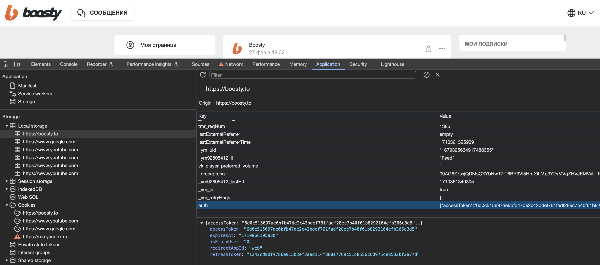
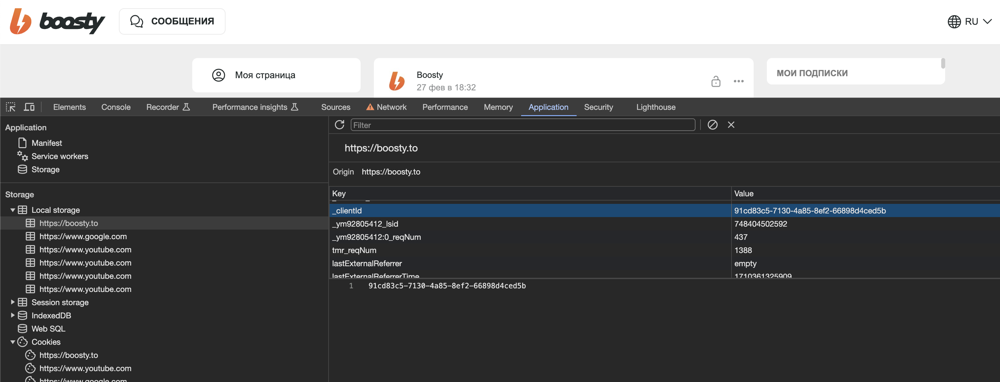

# boosty

Biblioteca para trabajar con la API privada de boosty

## Uso

La instalación es un poco inusual. Es necesario usar un dominio separado para `go get`:

```shell
go get gohome.4gophers.ru/getapp/boosty
```

El paquete se instalará desde el repositorio original https://gitflic.ru/project/getapp/boosty

Para la inicialización es necesario indicar el blog y el token. El token puede obtenerse desde el navegador

```golang
import (
    "log"
    "net/http"

    "gohome.4gophers.ru/getapp/boosty/auth"
    "gohome.4gophers.ru/getapp/boosty/boosty"
    "gohome.4gophers.ru/getapp/boosty/request"
)


auth, err := auth.New(
	auth.WithFile(".boosty"), 
	// auth.WithInfo(auth.Info{}), 
	auth.WithInfoUpdateCallback(func (i auth.Info) {
        log.Printf("info update: %+v\n", i)
    }),
)
if err != nil {
    log.Fatal(err)
}

request, err := request.New(
    //request.WithUrl("https://api.boosty.to"),
    request.WithClient(&http.Client{}),
    request.WithAuth(auth),
)
if err != nil {
    log.Fatal(err)
}

b, err := boosty.New("getapp", boosty.WithRequest(request))
if err != nil {
    log.Fatal(err)
}
```

## De dónde obtener la autenticación

Los datos de autenticación deben obtenerse de las cookies



Estos datos deben guardarse en formato JSON en el archivo `.boosty`, que es el archivo utilizado por defecto

```json
{
  "accessToken":"xxxxxxxxxxxxxxx",
  "refreshToken":"xxxxxxxxxxxxxxx",
  "expiresAt":1710966525,
  "deviceId":"xxxxxx-xxxx-xxxx-xxxx-xxxxxxxxx"
}
```

`deviceId` - este parámetro debe obtenerse por separado de la cookie:



Si los datos de autenticación caducan, la biblioteca intentará actualizar automáticamente los datos de autenticación y guardarlos en el archivo `.boosty`

## Actualizaciones

Canal de noticias [@kodikapusta](https://t.me/kodikapusta) y artículos en [kodikapusta.ru](https://kodikapusta.ru/)
