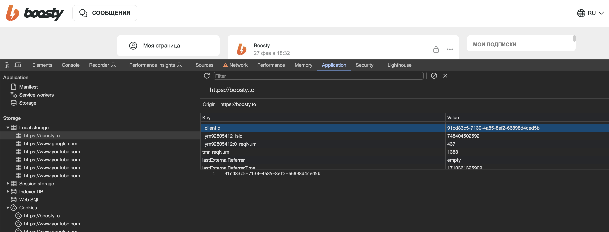

# boosty

Библиотека для работы с приватным API boosty

## Использование

Установка чуть нестандартная. Нужно использовать отдельный домен для go get:

```shell
go get gohome.4gophers.ru/getapp/boosty
```

Пакет будет устанавливаться из оригинального репозитория https://gitflic.ru/project/getapp/boosty

Для инициализации необходимо указать блог и токен. Токен можно забрать из браузера

```golang
import (
    "log"
    "net/http"

    "gohome.4gophers.ru/getapp/boosty/auth"
    "gohome.4gophers.ru/getapp/boosty/boosty"
    "gohome.4gophers.ru/getapp/boosty/request"
)


auth, err := auth.New(
	auth.WithFile(".boosty"), 
	// auth.WithInfo(auth.Info{}), 
	auth.WithInfoUpdateCallback(func (i auth.Info) {
        log.Printf("info update: %+v\n", i)
    }),
)
if err != nil {
    log.Fatal(err)
}

request, err := request.New(
    //request.WithUrl("https://api.boosty.to"),
    request.WithClient(&http.Client{}),
    request.WithAuth(auth),
)
if err != nil {
    log.Fatal(err)
}

b, err := boosty.New("getapp", boosty.WithRequest(request))
if err != nil {
    log.Fatal(err)
}
```

## Откуда брать авторизацию

Данные авторизации нужно забрать из cookies


Эти данные нужно перенести в JSON в файл .boosty - этот файл используется по умолчанию

```json
{
  "accessToken":"xxxxxxxxxxxxxxx",
  "refreshToken":"xxxxxxxxxxxxxxx",
  "expiresAt":1710966525,
  "deviceId":"xxxxxx-xxxx-xxxx-xxxx-xxxxxxxxx"
}
```

`deviceId` - этот параметр нужно получить отдельно из cookie:



Если данные авторизации протухнут, то библиотека сама попробует обновить 
авторизационные данные и сохранить из в файле .boosty

## Обновления

Канал с новостями [@kodikapusta](https://t.me/kodikapusta)
Статьи на [kodikapusta.ru](https://kodikapusta.ru/)